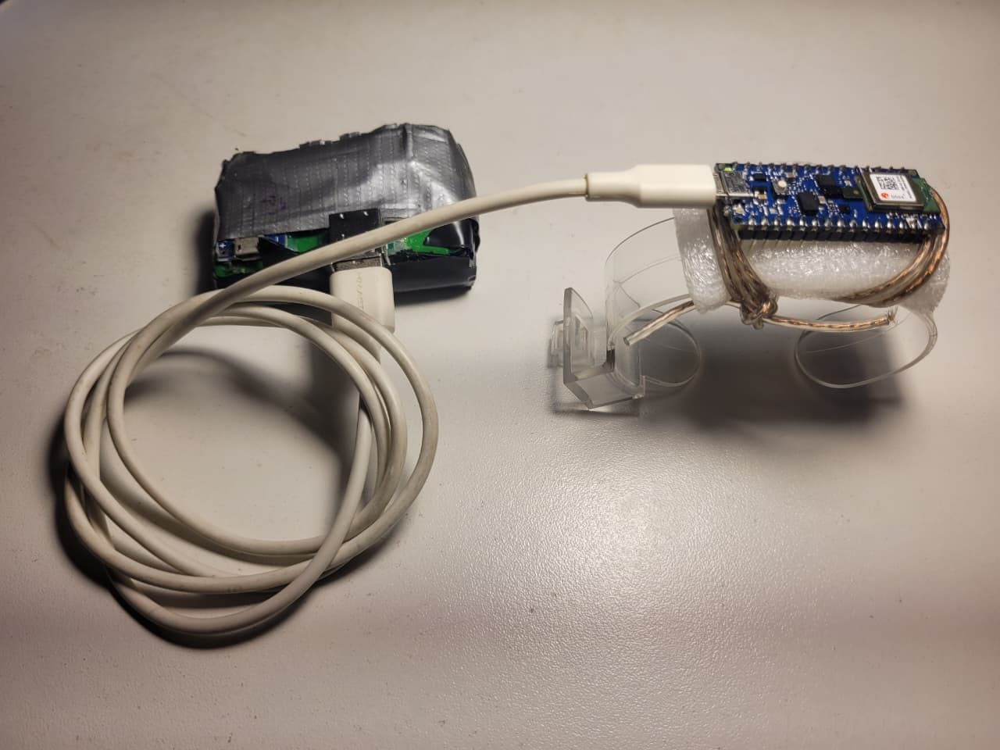
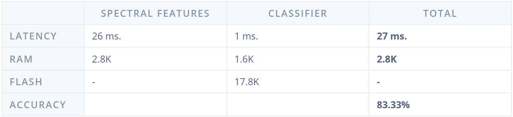
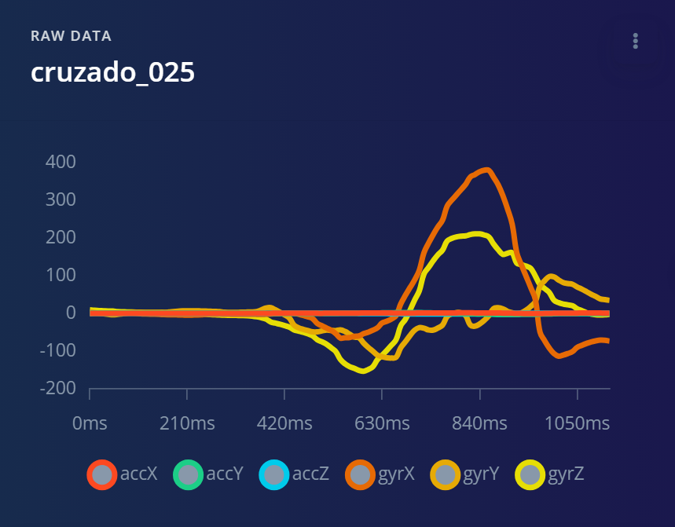
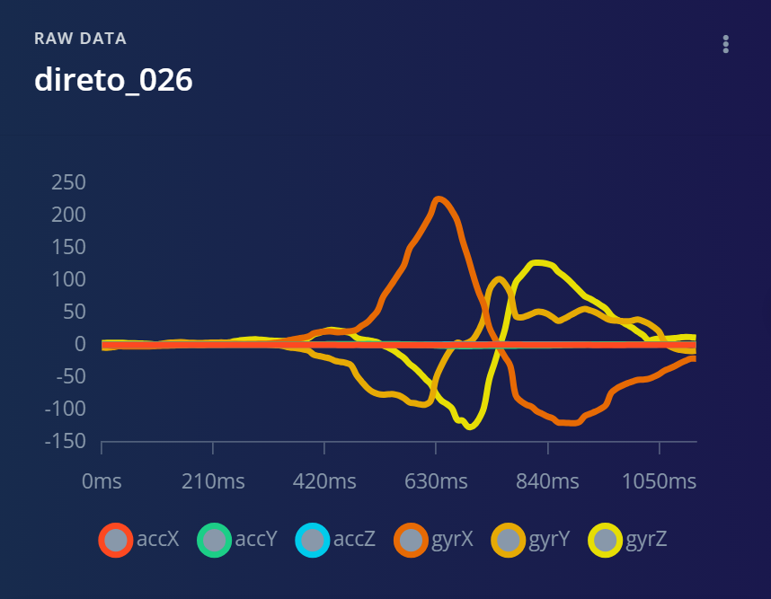
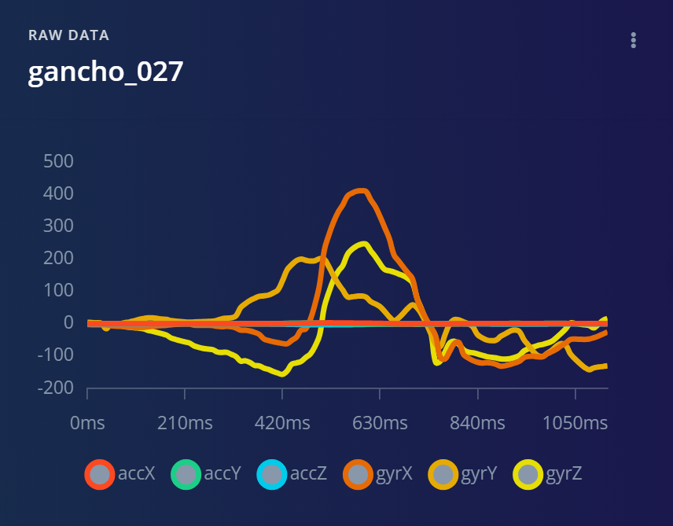
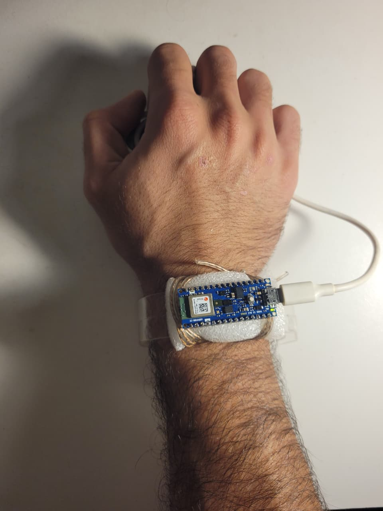

# 🥊 Dispositivo com IA para Classificação de Golpes

Sistema embarcado para reconhecimento em tempo real de golpes de boxe utilizando Inteligência Artificial executando diretamente em um **Arduino Nano 33 BLE Sense**.

---

## 📖 Visão Geral

Este projeto consiste em um dispositivo vestível capaz de identificar automaticamente golpes de boxe por meio dos sensores inerciais presentes no **Arduino Nano 33 BLE Sense**.

Inicialmente foi desenvolvido um sistema para aquisição de dados do acelerômetro e do giroscópio, permitindo a construção de um dataset contendo cinco classes de movimentos:

- Direto
- Cruzado
- Gancho
- Guarda
- Neutro

Após a coleta dos dados, o dataset foi utilizado para treinar um modelo de Inteligência Artificial na plataforma **Edge Impulse**. O modelo treinado foi então exportado como uma biblioteca compatível com a Arduino IDE, permitindo que toda a inferência seja executada diretamente na placa, sem necessidade de conexão com a internet.

---

## ⚙️ Funcionamento

O dispositivo realiza continuamente a leitura do **acelerômetro** (X, Y, Z) e do **giroscópio** (X, Y, Z) embarcados no microcontrolador.

As leituras são enviadas ao modelo de Inteligência Artificial embarcado, responsável por identificar qual golpe está sendo executado.

O resultado da inferência é disponibilizado via **Bluetooth Low Energy (BLE)** para uma interface Web, permitindo acompanhar as classificações em tempo real.

---

## 🔧 Hardware

<p align="center">
  
</p>

### Componentes utilizados

- Arduino Nano 33 BLE Sense
- Bateria USB 5 V
- Suporte de acrílico para relógio
- Cabo USB

---

## 📂 Aquisição do Dataset

O código localizado em `codigos/aquisicao_dataset` foi utilizado para construir o dataset empregado no treinamento da Inteligência Artificial.

Cada aquisição possui aproximadamente **1 segundo** de duração. Durante esse período foram registradas as seguintes informações:

- Timestamp
- Aceleração X
- Aceleração Y
- Aceleração Z
- Velocidade Angular X
- Velocidade Angular Y
- Velocidade Angular Z

Os dados foram armazenados em arquivos CSV. O dataset encontra-se organizado conforme mostrado abaixo:

```text
dataset_construido
│
├── cruzado
├── direto
├── gancho
├── guarda
└── neutro
```

Cada classe contém **30 arquivos CSV**, correspondentes a 30 execuções independentes do movimento. Cada arquivo representa aproximadamente **1 segundo** de dados coletados pelos sensores.

---

## 🧠 Treinamento do Modelo

Após a aquisição do dataset, foram realizadas as seguintes etapas:

1. Importação dos arquivos CSV para o Edge Impulse;
2. Treinamento do modelo de Inteligência Artificial;
3. Exportação do modelo como biblioteca para Arduino IDE.

A biblioteca exportada encontra-se disponível no arquivo `biblioteca_edgeimpulse_gerada.zip`.

---

## 💻 Código Principal

O código principal encontra-se em `codigos/main`. Este código é responsável por:

- realizar a leitura do acelerômetro;
- realizar a leitura do giroscópio;
- executar a inferência do modelo de IA;
- disponibilizar os resultados via Bluetooth Low Energy;
- atualizar os contadores de golpes reconhecidos.

---

## 📈 Resultados

### Matriz de Confusão

<p align="center">
  
</p>

### Desempenho do Modelo

<p align="center">
  
</p>

### Padrão dos Sinais Coletados

O desenvolvimento do sistema foi possível devido aos diferentes sinais gerados durante a execução de cada golpe. Observou-se que cada movimento apresenta um padrão característico nos sinais obtidos pelos sensores, permitindo a classificação dos golpes realizados.

Além das classes correspondentes aos golpes, foram adicionadas as classes **Guarda** e **Neutro**. Essas classes têm como objetivo auxiliar o modelo a diferenciar estados que não representam golpes, evitando classificações incorretas durante o uso do sistema. Dessa forma, elas não são utilizadas como critérios de classificação para exibição ao usuário, mas sim como estados auxiliares para melhorar a tomada de decisão do modelo.

No entanto, verificou-se que os valores provenientes do acelerômetro apresentaram pouca variação durante os movimentos, indicando menor contribuição desse sensor para a diferenciação entre as classes.

<p align="center">
  
  
  
</p>

---

## 🚀 Como Utilizar

### Instalação da Biblioteca

Na Arduino IDE:

```
Sketch
→ Include Library
→ Add .ZIP Library...
```

Selecione o arquivo `biblioteca_edgeimpulse_gerada.zip`.

Após a instalação, a biblioteca estará disponível para compilação do projeto.

### Alimentação

Conecte o Arduino Nano 33 BLE Sense a uma bateria USB de 5 V.

### Posicionamento

Fixe o dispositivo no **pulso direito**, conforme ilustrado abaixo.

**Importante:** o conector USB deve ficar voltado para o dedo mindinho.

<p align="center">
  
</p>

### Conexão BLE

Abra a interface Web compatível com Bluetooth Low Energy e conecte-se ao dispositivo.

### Execução

Após conectado, realize um dos golpes:

- Direto
- Cruzado
- Gancho

Sempre que um golpe for identificado, o contador correspondente será incrementado automaticamente na interface.
