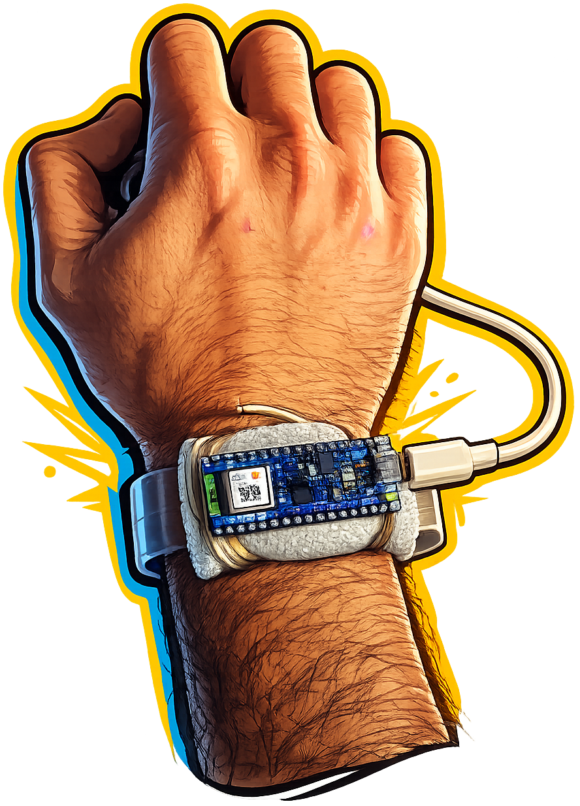

<div align="right">
  🇺🇸 <strong>English</strong> | 🇧🇷 <a href="README.pt-br.md">Português</a>
</div>
<br>
<table border="0">
  <tr>
    <td width="220" align="center" valign="middle">
      
    </td>
    <td valign="middle">
      <h1>Wearable Device with TinyML for Punch Recognition in Combat Sports</h1>
    </td>
  </tr>
</table>

Embedded system for real-time recognition of boxing punches using Artificial Intelligence running directly on an **Arduino Nano 33 BLE Sense**.

---

## 📖 Overview

Project developed as the final assignment for the course **Special Topics I – AI at the Edge (DEC7551)**, in the **Computer Engineering** program at the **Federal University of Santa Catarina – Araranguá Campus**, under the supervision of **Prof. Dr. Roderval Marcelino**.

Author: **Lucas Porto Ribeiro**

Semester: **2026/1**

## 🎯 Objective

This project aims to develop a wearable device capable of automatically identifying boxing punches using Artificial Intelligence embedded in the **Arduino Nano 33 BLE Sense**.

To develop the model, data was collected from movements performed during the punches, allowing the construction of a dataset containing five classes:

- Cross (Direto)
- Hook (Cruzado)
- Uppercut (Gancho)
- Guard (Guarda)
- Neutral (Neutro)

---

## ⚙️ How it Works

The device continuously reads the **accelerometer** (X, Y, Z) and **gyroscope** (X, Y, Z) embedded in the microcontroller.

The readings are sent to the embedded Artificial Intelligence model, which is responsible for identifying the executed punch.

The inference result is made available via **Bluetooth Low Energy (BLE)** to a Web interface, allowing real-time monitoring of the classifications.

---

## 🔧 Hardware

<p align="center">
  
</p>

### Components Used

- Arduino Nano 33 BLE Sense
- 5V USB Battery
- Acrylic watch holder
- USB Cable

---

## 📂 Dataset Acquisition

The code located in `codigos/aquisicao_dataset` was used to build the dataset for training the Artificial Intelligence.

Each acquisition lasts approximately **1 second**. During this period, the following information was recorded:

- Timestamp
- Acceleration X
- Acceleration Y
- Acceleration Z
- Angular Velocity X
- Angular Velocity Y
- Angular Velocity Z

The data was stored in CSV files. The dataset is organized as shown below:

```text
dataset_construido
│
├── cruzado
├── direto
├── gancho
├── guarda
└── neutro
```

Each class contains **30 CSV files**, corresponding to 30 independent executions of the movement. Each file represents approximately **1 second** of data collected by the sensors.

---

## 🧠 Model Training

After acquiring the dataset, the following steps were performed:

1. Import of CSV files to Edge Impulse;
2. Training of the Artificial Intelligence model;
3. Export of the model as an Arduino IDE library.

The exported library is available in the `biblioteca_edgeimpulse_gerada.zip` file.

---

## 💻 Main Code

The main code is located in `codigos/main`. This code is responsible for:

- reading the accelerometer;
- reading the gyroscope;
- executing the AI model inference;
- making the results available via Bluetooth Low Energy;
- updating the counters for recognized punches.

---

## 📈 Results

### Confusion Matrix

<p align="center">
  
</p>

### Model Performance

<p align="center">
  
</p>

### Pattern of Collected Signals

The system's development was possible due to the different signals generated during the execution of each punch. It was observed that each movement presents a characteristic pattern in the signals obtained by the sensors, allowing the classification of the executed punches.

In addition to the classes corresponding to the punches, the **Guard** and **Neutral** classes were added. These classes aim to help the model differentiate states that do not represent punches, avoiding incorrect classifications during system use. Thus, they are not used as classification criteria for display to the user, but rather as auxiliary states to improve the model's decision-making.

However, it was found that the values from the accelerometer showed little variation during the movements, indicating a lower contribution of this sensor to the differentiation between classes.

<p align="center">
  
  
  
</p>

---

## 🚀 How to Use

### Library Installation

In the Arduino IDE:

```
Sketch
→ Include Library
→ Add .ZIP Library...
```

Select the `biblioteca_edgeimpulse_gerada.zip` file.

After installation, the library will be available to compile the project.

### Power Supply

Connect the Arduino Nano 33 BLE Sense to a 5V USB battery.

### Positioning

Attach the device to your **right wrist**, as illustrated below.

**Important:** the USB connector must face the pinky finger.

<p align="center">
  
</p>

### BLE Connection

Open a Web interface compatible with Bluetooth Low Energy and connect to the device.

### Execution

Once connected, perform one of the punches:

- Cross
- Hook
- Uppercut

Whenever a punch is identified, the corresponding counter will be automatically incremented in the interface.

## 🔗 Project Documents

- 📄 [Slide Presentation](apresentacao.pdf)
