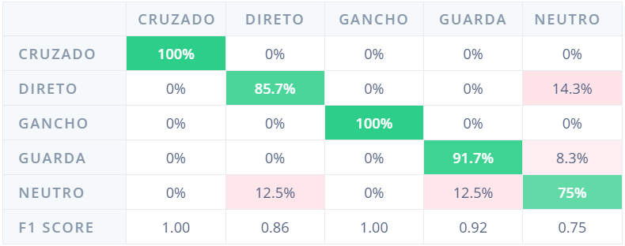

# 🥊 Dispositivo com IA para Classificação de Golpes

Sistema embarcado para reconhecimento em tempo real de golpes de boxe utilizando Inteligência Artificial executando diretamente em um **Arduino Nano 33 BLE Sense**.

---

# 📖 Visão Geral

Este projeto consiste em um dispositivo vestível capaz de identificar automaticamente golpes de boxe por meio dos sensores inerciais presentes no **Arduino Nano 33 BLE Sense**.

Inicialmente foi desenvolvido um sistema para aquisição de dados do acelerômetro e do giroscópio, permitindo a construção de um dataset contendo cinco classes de movimentos:

- Direto
- Cruzado
- Gancho
- Guarda
- Neutro

Após a coleta dos dados, o dataset foi utilizado para treinar um modelo de Inteligência Artificial na plataforma **Edge Impulse**. O modelo treinado foi então exportado como uma biblioteca compatível com a Arduino IDE, permitindo que toda a inferência seja executada diretamente na placa, sem necessidade de conexão com a internet.

---

# 📸 Dispositivo

<p align="center">

</p>

---

# 🔧 Hardware

## Componentes utilizados

- Arduino Nano 33 BLE Sense
- Bateria USB 5 V (Power Bank)
- Pulseira/suporte para relógio
- Cabo USB

---

# ⚙️ Funcionamento

O dispositivo realiza continuamente a leitura dos sensores embarcados:

### Acelerômetro

- X
- Y
- Z

### Giroscópio

- X
- Y
- Z

As leituras são enviadas ao modelo de Inteligência Artificial embarcado, responsável por identificar qual golpe está sendo executado.

O resultado da inferência é disponibilizado via **Bluetooth Low Energy (BLE)** para uma interface Web, permitindo acompanhar as classificações em tempo real.

---

# 📁 Estrutura do Projeto

```text
.
├── codigos
│   ├── aquisicao_dataset
│   │   └── aquisicao_dataset.ino
│   │
│   └── main
│       └── main.ino
│
├── dataset_construido
│   ├── cruzado
│   ├── direto
│   ├── gancho
│   ├── guarda
│   └── neutro
│
├── biblioteca_edgeimpulse_gerada.zip
│
└── README.md
```

---

# 📂 Aquisição do Dataset

O código localizado em

```text
codigos/aquisicao_dataset
```

foi utilizado para construir o dataset empregado no treinamento da Inteligência Artificial.

Cada aquisição possui aproximadamente **1 segundo** de duração.

Durante esse período são registradas as seguintes informações:

- Timestamp
- Aceleração X
- Aceleração Y
- Aceleração Z
- Velocidade Angular X
- Velocidade Angular Y
- Velocidade Angular Z

Os dados são armazenados em arquivos CSV.

---

# 📊 Dataset

O dataset encontra-se organizado conforme mostrado abaixo:

```text
dataset_construido
│
├── cruzado
├── direto
├── gancho
├── guarda
└── neutro
```

Cada classe contém **30 arquivos CSV**, correspondentes a 30 execuções independentes do movimento.

Cada arquivo representa aproximadamente **1 segundo** de dados coletados pelos sensores.

---

# 🧠 Treinamento do Modelo

Após a aquisição do dataset, foram realizadas as seguintes etapas:

1. Importação dos arquivos CSV para o Edge Impulse;
2. Processamento dos sinais;
3. Treinamento do modelo de Inteligência Artificial;
4. Exportação do modelo como biblioteca para Arduino IDE.

A biblioteca exportada encontra-se disponível no arquivo:

```text
biblioteca_edgeimpulse_gerada.zip
```

---

# 📦 Instalação da Biblioteca

Na Arduino IDE:

```
Sketch
→ Include Library
→ Add .ZIP Library...
```

Selecione o arquivo:

```
biblioteca_edgeimpulse_gerada.zip
```

Após a instalação, a biblioteca estará disponível para compilação do projeto.

---

# 💻 Código Principal

O código principal encontra-se em

```text
codigos/main
```

Este código é responsável por:

- realizar a leitura do acelerômetro;
- realizar a leitura do giroscópio;
- executar a inferência do modelo de IA;
- disponibilizar os resultados via Bluetooth Low Energy;
- atualizar os contadores de golpes reconhecidos.

---

# 🚀 Como Utilizar

## 1. Alimentação

Conecte o Arduino Nano 33 BLE Sense a uma bateria USB de 5 V.

---

## 2. Posicionamento

Fixe o dispositivo no **pulso direito**, conforme ilustrado abaixo.

**Importante:** o conector USB deve ficar voltado para o dedo mínimo.

<p align="center">

</p>

---

## 3. Conexão BLE

Abra a interface Web compatível com Bluetooth Low Energy e conecte-se ao dispositivo.

---

## 4. Execução

Após conectado, realize um dos golpes:

- Direto
- Cruzado
- Gancho

Sempre que um golpe for identificado, o contador correspondente será incrementado automaticamente na interface.

---

# 📈 Resultados

## Matriz de Confusão

<p align="center">

</p>

---

## Desempenho do Modelo

<p align="center">

</p>

Exemplo de métricas apresentadas:

- Accuracy
- Precision
- Recall
- F1-score
- Tempo de inferência (~1 ms)
- Uso de memória RAM
- Uso de memória Flash

---

# 📉 Sinais Coletados

## Direto

<p align="center">

</p>

---

## Cruzado

<p align="center">

</p>

---

## Gancho

<p align="center">

</p>

---

# 🛠 Tecnologias Utilizadas

- Arduino IDE
- Arduino Nano 33 BLE Sense
- Edge Impulse
- TinyML
- Bluetooth Low Energy (BLE)
- C++
- Machine Learning Embarcado

---

# 📄 Licença

Este projeto foi desenvolvido para fins acadêmicos e de pesquisa.
